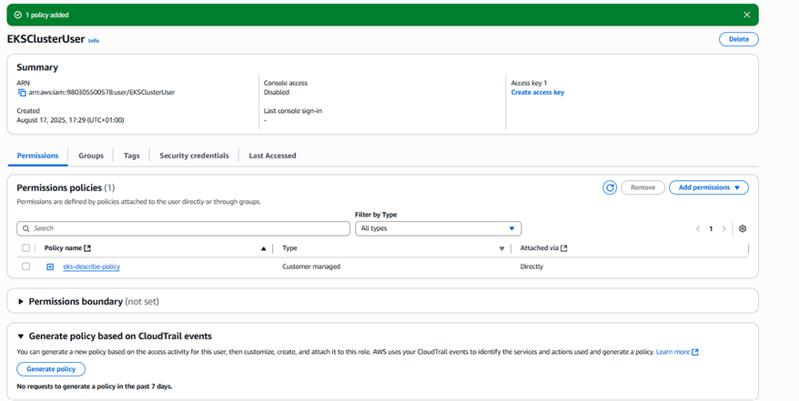

# How to access AWS to create EKS WITH TERRAFORM

## 1. AWS role-based access control

### SECTION INFORMATION:
	Purpose of this section is to show how we can setup ROLE-BASED ACCESS CONTROL permission for EKS Cluster.

-	Create Role and Assign Administrator Permission 
-	Create user to assume the Role to become the cluster creator
-	Reference profile of the role in Terraform code for EKS Cluster.

## CREATE USER: 

    1.	EKSClusterUser = Do not attach any permission, copy ARN. 

## ROLE CREATION: 
    1.	EKSClusterCreatorRole = IAM -> ROLES -> AWS Service (EC2) -> Administrative Access.

    2.	Edit TrustRelationship –> Allow user (EKSClusterUser) to assume Role
            {
                "Version": "2012-10-17",
                "Statement": [
                    {
                        "Effect": "Allow",
                        "Principal": {
                            "AWS": "arn:aws:iam::980305500578:user/EKSClusterUser"
                        },
                        "Action": "sts:AssumeRole"
                    }
                ]
            }
##  CREATE EKS DESCRIBE CLUSTER POLICY (IDENTIY-BASED POLICY)
As an AWS administrator, you need the describe policy to create and administer EKS clusters. You cannot execute certain commands if you cannot describe the cluster. Since AWS does not include this permission in the IAM administrator policy by default, you must create a custom policy that includes it and then attach that policy to the cluster administrator.

        AWS IAM console ➤ Policies. 
        Click the Create policy button, then click the JSON button to open the Policy editor.

            {
                "Version": "2012-10-17",
                "Statement": [
                    {
                        "Effect": "Allow",
                        "Action": "eks:DescribeCluster",
                        "Resource": "*"
                    }
                ]
            }

##  ATTACH EKS DESCRIBE CLUSTER POLICY TO USER 
 
    1.	Navigate to the AWS IAM console ➤ Users ➤ Joyce. 
    2.	Click the Permissions tab. 
    3.	Click Add permissions ➤ Attach policies directly. 
    4.	Select the eks-describe-policy you just created. 
    5.	Click Next ➤ Add permissions.

##  CONFIGURE ROLE IN AWS CREDENTIAL FILE:

    1.	Navigate to the AWS IAM console ➤ User. Click the user Joyce. 
    2.	Create access key ID and secret access key for the user. 
    3.	Install the AWS CLI on your local machine and configure it or edit the .aws/credentials file if the AWS CLI is already installed and configured. 
    4.	Edit the .aws/credentials file as follows:

        Create access keys, edit .aws/credentials file
        [EKSClusterUser-credentials]
        aws_access_key_id = <YOUR_AWS_ACCESS_KEY_ID>
        aws_secret_access_key = >YOUR_AWS_SECRET_ACCESS_KEY>

        [EKSClusterUser-role]
        Role_arn = arn:aws:iam::980305500578:role/EKSClusterCreatorRole
        Source_profile = EKSClusterUser-credentials
        Region = us-east-1

## EKSClusterUser-role is the reference to profile which can be referenced into terraform code

    provider "aws" {
    region = "us-east-1"
    profile  = " EKSClusterUser-role "
    }

